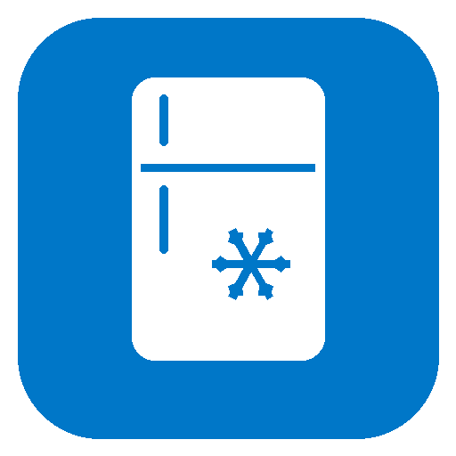

# Alpicool / ICECO Fridge – Home Assistant BLE Integration

Native HA-Integration (kein extra ESP32 als MQTT-Gateway nötig) für Alpicool/ICECO/BougeRV
Kompressor-Kühlboxen mit BLE-Steuerung (App "Car Fridge Freezer", BLE-Name beginnt mit
`A1-`, `AK1-`, `AK2-`, `AK3-` oder `WT-`).

Protokoll portiert aus: https://github.com/jakub-hajek/alpicool-esp32-mqtt
(Reverse Engineering: @klightspeed, Go-Referenzimplementierung: @johnelliott)
Protokoll zusätzlich gegen die offizielle Android-APK verifiziert.

## Voraussetzungen

- Home Assistant mit Bluetooth-Integration aktiv (Host-Adapter oder ESPHome-Bluetooth-Proxy
  in Reichweite des Kühlschranks)
- Kühlschrank darf NICHT gleichzeitig in der Hersteller-App verbunden sein (nur eine
  BLE-Connection gleichzeitig möglich)

## Installation

### Über HACS (empfohlen)

1. HACS → Integrationen → Menü (⋮) oben rechts → **Benutzerdefinierte Repositories**
2. Repository-URL eintragen, Kategorie **Integration** wählen, Hinzufügen
3. "Alpicool / ICECO Fridge (BLE)" suchen und installieren
4. Home Assistant neu starten

### Manuell

1. Ordner `custom_components/alpicool_fridge` nach `<config>/custom_components/` kopieren
2. Home Assistant neu starten

## Einrichtung

Einstellungen → Geräte & Dienste → der Kühlschrank wird automatisch als Bluetooth-Gerät
erkannt (z.B. "A1-XXXXXX" oder "WT-0001") → Hinzufügen bestätigen.

Falls keine Auto-Discovery erfolgt: Integration manuell hinzufügen, Gerät aus Liste wählen.

## Entities

- `climate.xxx` – Ein/Aus (HVAC cool/off), Zieltemperatur, Eco-Preset
- `sensor.xxx_spannung` – Versorgungsspannung
- `binary_sensor.xxx_tastensperre` – Tastensperre aktiv

## Status / offene Punkte

- An echter Hardware getestet und funktionsfähig (siehe CHANGELOG).
- Doppel-Zonen-Modelle (zwei Kompressoren) werden vom Protokoll evtl. nicht abgedeckt –
  das Referenz-Repo deckt nur Single-Zone ab.
- Settings wie Hysterese, Min/Max-Temp-Grenzen (E1-E9-Menüs) werden aktuell nur gelesen,
  nicht über die UI änderbar (würden sich aber leicht als `number`-Entities ergänzen lassen).

## Changelog

Siehe [CHANGELOG.md](CHANGELOG.md).
